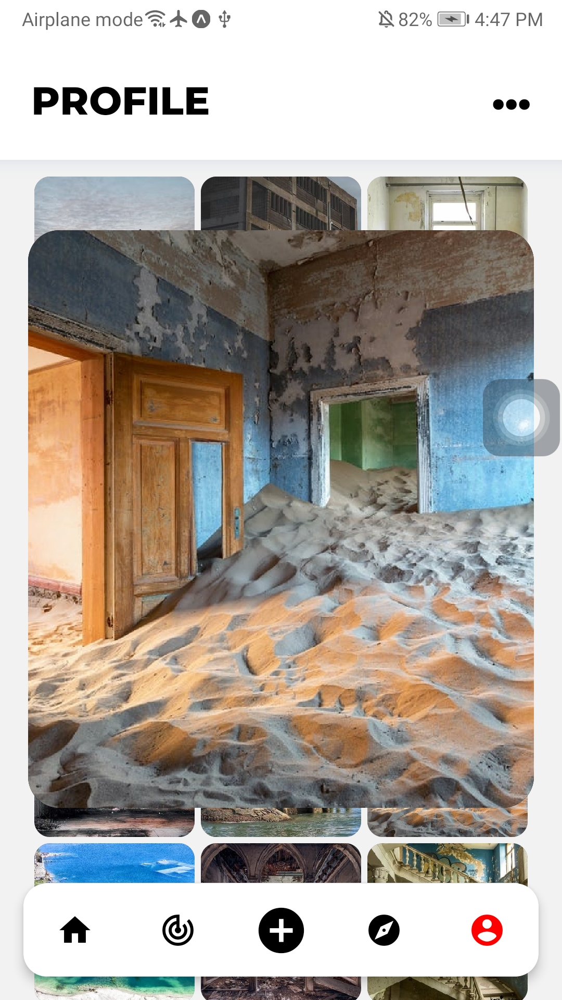
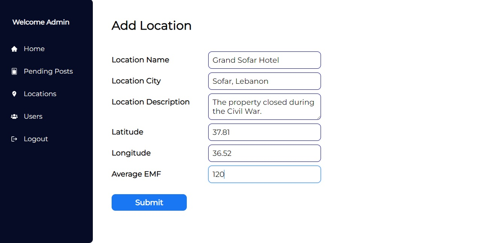

<div align="center">

> Hello world! This is the project’s summary that describes the project plain and simple, limited to the space available. 

> **[PROJECT PHILOSOPHY](https://github.com/julescript/well_app#-project-philosophy) • [WIREFRAMES](https://github.com/julescript/well_app#-wireframes) • [TECH STACK](https://github.com/julescript/well_app#-tech-stack) • [IMPLEMENTATION](https://github.com/julescript/well_app#-impplementation) • [HOW TO RUN?](https://github.com/julescript/well_app#-how-to-run)**

</div>

<br><br>


> The Well app is a mental health and mindfulness app built on top of the science of positive psychology. The Well app is more than just another meditation or journaling app; it encourages you to enhance and reflect on your day with structured, guided activities.
>
> There are 5 daily tasks that the Well app asks you to complete each day: record 3 gratitudes, write a journal entry, perform 3 acts of kindness, exercise for 20 minutes, and meditate for 15 minutes.

### User Stories

- As a user, I want to browsse ablums, so that I can find quick links
- As a user, I want to browsse ablums, so that I can find quick links
- As a user, I want to browsse ablums, so that I can find quick links

<br><br>


> This design was planned before on paper, then moved to Figma app for the fine details.
> Note that i didn't use any styling library or theme, all from scratch and using pure css modules

> <br><br>
> <kbd></kbd> <kbd></kbd> <kbd></kbd> <br><br> <kbd></kbd> <kbd></kbd> <kbd></kbd>

<br><br>


Here's a brief high-level overview of the tech stack the Forsaken app uses:

- This project uses the [React Native development library](https://reactnative.dev/). React Native combines the best parts of native development with React, a best-in-class JavaScript library for building user interfaces.
- For the admin page, the app uses the [React Javascript library](https://reactjs.org/) which allows the admin to acces the dashboard and monitor the data running through the app.
- As for the backend, the app uses a php framework called [Laravel](https://laravel.com/) along with a database management system called [phpMyAdmin](https://www.phpmyadmin.net/) to manage the api calls and to store data.

<br><br>


> Uing the above mentioned tecch stacks and the wireframes build with figma from the user sotries we have, the implementation of the app is shown as below, these are screenshots from the real app
> <br><br>

> | App GIFs |
> | -------- |
>
> <kbd></kbd> <kbd></kbd> <kbd></kbd> <kbd></kbd> <kbd></kbd> <kbd></kbd> <kbd></kbd> <kbd></kbd> <kbd></kbd>

<br><br>

> | App Screenshots |
> | --------------- |
>
> <kbd></kbd> <kbd></kbd> <kbd></kbd> <kbd></kbd> <kbd></kbd> <kbd></kbd> <kbd></kbd> <kbd></kbd> <kbd></kbd> <kbd></kbd> <kbd></kbd> <kbd></kbd> <kbd></kbd> <kbd></kbd> <kbd></kbd>

<br><br>

> | Admin Screenshots |
> | --------------- |
>
> <kbd></kbd> <kbd></kbd> <kbd></kbd> <kbd></kbd> <kbd></kbd> 

<br><br>


<br><br>

### Prerequisites

_Below are the prerequisite software you need to run the app_

- VSCode: Download from [here](https://code.visualstudio.com/)

_Then run the following commands in the terminal_

- npm
  ```sh
  npm install npm@latest -g
  ```

- expo cli
  ```sh
  npm install --global expo-cli
  ```

### Installation

_Below are the instructions on how to run the App and the Admin Panel_

1. Clone the repo
   ```sh
   git clone https://github.com/pablo-sreih/forsaken.git
   ```
2. Install NPM packages
   ```sh
   npm install
   ```
3. For the app you need to run
   ```js
   expo start
   ```
4. For the admin page you need to run
   ```js
   npm start
   ```
5. To run the server in Laravel

   1. First you need to install Composer from [here](https://getcomposer.org/download/)
      then run the below command to install the dependencies
      ```js
      composer install
      ```
   2. Migrate to the database by running 
      ```js
      php artisan migrate
      ```
   3. Finally run the server with
      ```js
      php artisan serve
      ```
